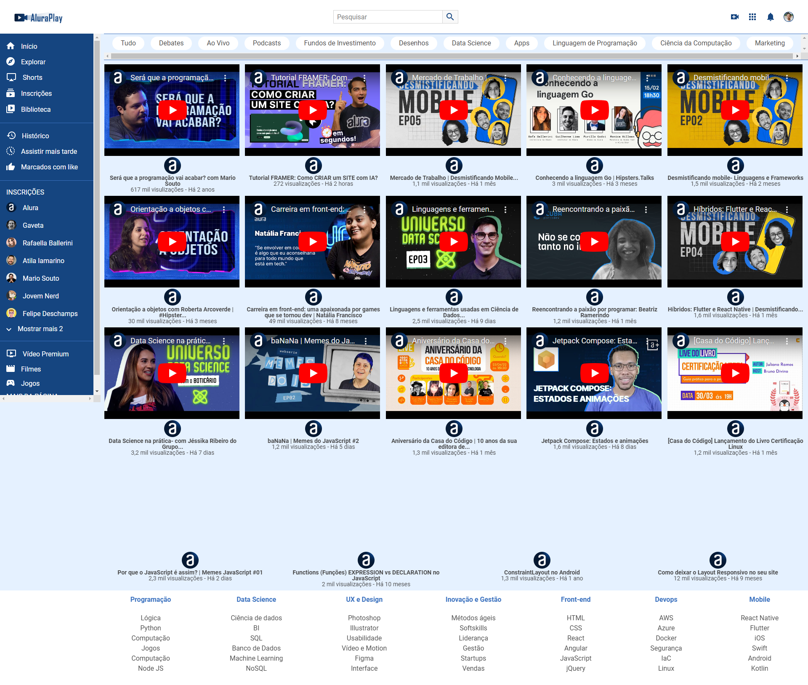

# AluraPlay
 Site criado com HTML e CSS

Projeto feito durante a aula na plataforma Alura, criado utilizando HTML e CSS, com tecnicas de flexbox.

| :placard: Vitrine.Dev |     |
| -------------  | --- |
| :sparkles: Nome        | **AluraPlay**
| :label: Tecnologias | HTML, CSS, Figma
| :rocket: URL         | https://alura-play-rose-six.vercel.app/

<!-- Inserir imagem com a #vitrinedev ao final do link -->
